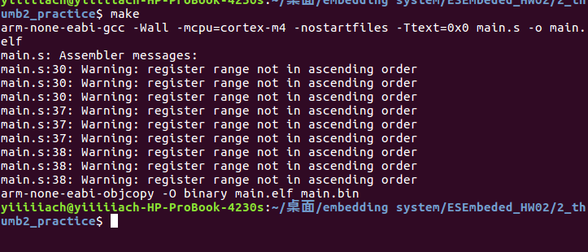

E940346042 Hw02
===
This is the hw02 sample. Please follow the steps below.

# Build the Sample Program

1. Fork this repo to your own github account.

2. Clone the repo that you just forked.

3. Under the hw02 dir, use:

	* `make` to build.

	* `make clean` to clean the ouput files.

4. Extract `gnu-mcu-eclipse-qemu.zip` into hw02 dir. Under the path of hw02, start emulation with `make qemu`.

	See [Lecture 02 ─ Emulation with QEMU] for more details.

5. The sample is designed to help you to distinguish the main difference between the `b` and the `bl` instructions.  

	See [ESEmbedded_HW02_Example] for knowing how to do the observation and how to use markdown for taking notes.

# Build Your Own Program

1. Edit main.s.

2. Make and run like the steps above.

# HW02 Requirements

1. Please modify main.s to observe the `push` and the `pop` instructions:  

	Does the order of the registers in the `push` and the `pop` instructions affect the excution results?  

	For example, will `push {r0, r1, r2}` and `push {r2, r0, r1}` act in the same way?  

	Which register will be pushed into the stack first?

2. You have to state how you designed the observation (code), and how you performed it.  

	Just like how [ESEmbedded_HW02_Example] did.

3. If there are any official data that define the rules, you can also use them as references.

4. Push your repo to your github. (Use .gitignore to exclude the output files like object files or executable files and the qemu bin folder)

[Lecture 02 ─ Emulation with QEMU]: http://www.nc.es.ncku.edu.tw/course/embedded/02/#Emulation-with-QEMU
[ESEmbedded_HW02_Example]: https://github.com/vwxyzjimmy/ESEmbedded_HW02_Example

--------------------

- [x] **If you volunteer to give the presentation next week, check this.**

--------------------

Please take your note here.
1. design of my experiment
process of experiment
[first] see the result of push and pop by insert instruction one by one 
[second] see the result of push in ascending order  push {r0,r1,r2,r3}
[third]  see the result of push in descending order push {r3,r2,r1,r0}
	
2. when I try to makefile my assembly code main.s , there are some warning coming out.
it said that my register range out of ascending order. Everytime the regs after pop and push instruction were not in ascending order the warning sign comes out.
ex: 	push {r4,r3,r2,r1} =>> warning
	pop  {r7,r6,r5,r4} =>> warning 

3. Later I emulate the main.s , the result become strange . when it comes to push or pop instruction in decsending order at original code ,it will turn out to become ascending order.

(original )                  ( result show on emulator)
push {r2,r1,r0}   	      push {r0,r1,r2}
![Image 2] (./2.png)

